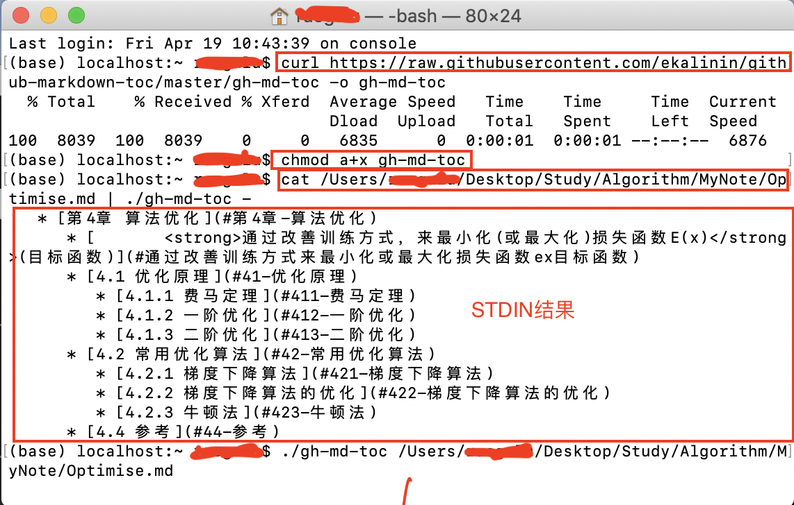
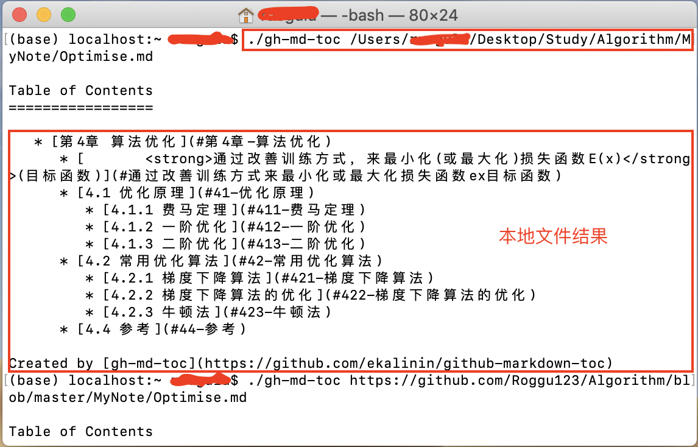
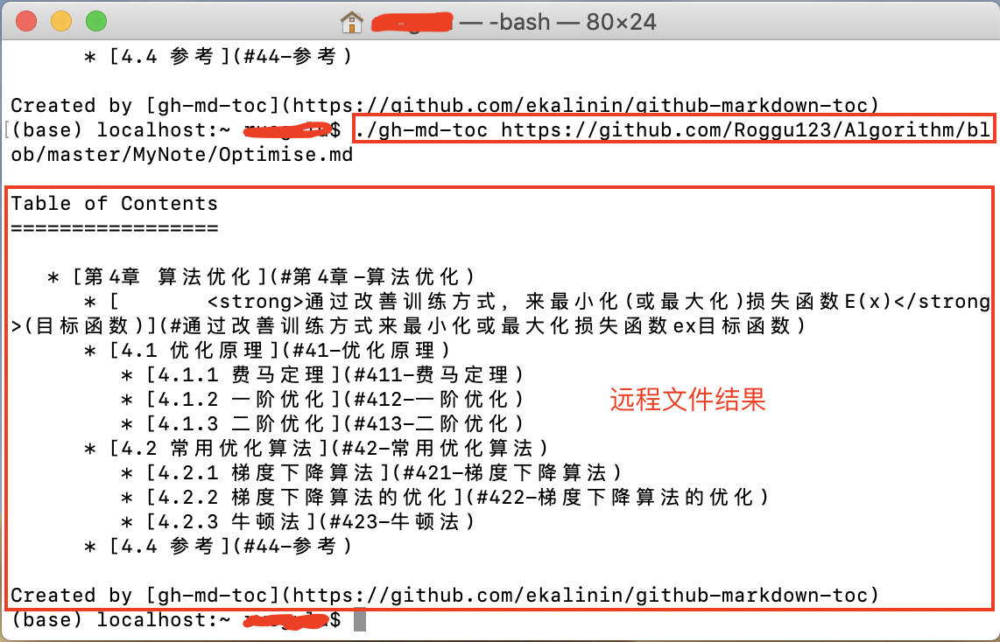
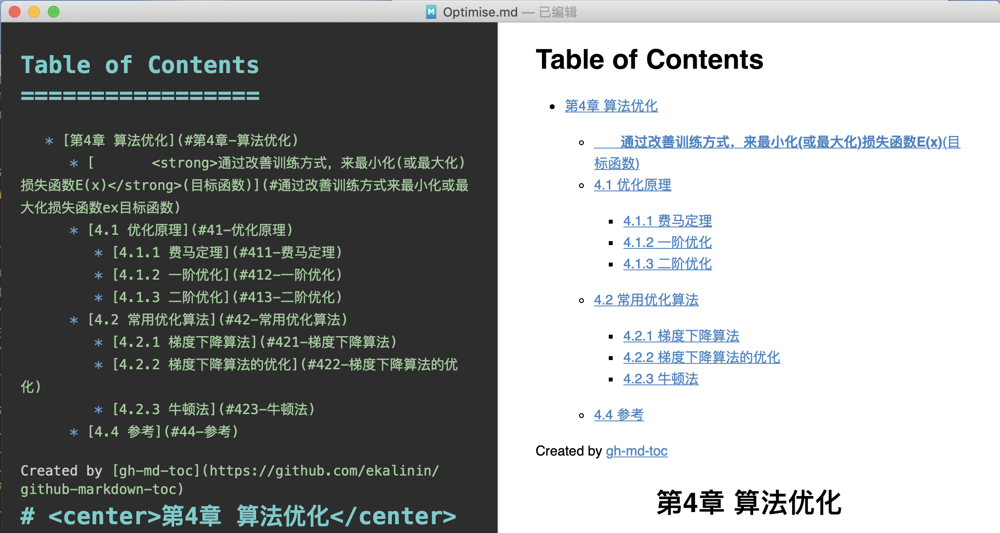
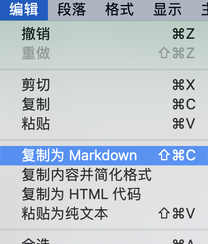
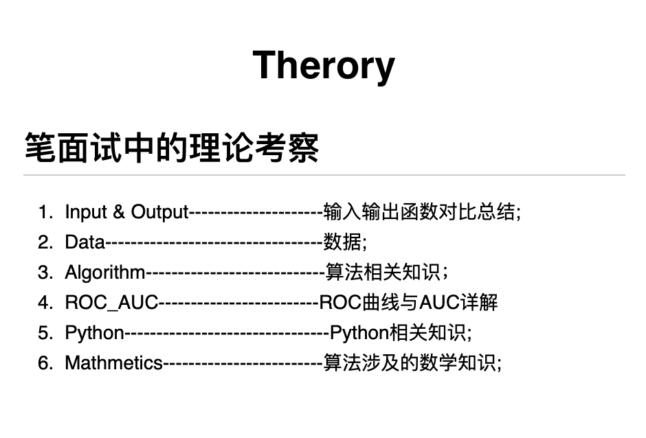

Table of Contents
=================

   * [Markdown](#markdown)
      * [2.1 格式问题](#21-格式问题)
         * [2.1.1 如何换行](#211-如何换行)
            * [方法一  两段文字间两个空格再回车](#方法一--两段文字间两个空格再回车)
            * [方法二  两段文字间空一行](#方法二--两段文字间空一行)
            * [方法三 两段文字间添加标签 &lt;br&gt;..&lt;/br&gt;](#方法三-两段文字间添加标签-brbr)
         * [2.1.2 代码块的对齐方式](#212-代码块的对齐方式)
            * [方法详解](#方法详解)
            * [参考](#参考)
         * [2.1.3 多行公式](#213-多行公式)
            * [长公式](#长公式)
            * [公式组](#公式组)
            * [分支公式](#分支公式)
            * [公式编号](#公式编号)
         * [2.1.4 如何添加副标题](#214-如何添加副标题)
         * [2.1.5 如何添加注释](#215-如何添加注释)
            * [2.1.5.1 方法详解](#2151-方法详解)
            * [2.1.5.2 参考](#2152-参考)
         * [2.1.6 如何插入目录](#216-如何插入目录)
         * [2.1.7 绘制表格](#217-绘制表格)
         * [2.1.8 绘制树状目录](#218-绘制树状目录)
         * [2.1.9 画流程图](#219-画流程图)
         * [2.1.10 画函数图像](#2110-画函数图像)  
         * [2.1.11 图片相关](#2111-图片相关)
            * [插入图片](#21111-插入图片)
            * [并排显示](#21112-并排显示) 
         
      * [2.2 符号问题](#22-符号问题)  
         * [2.2.1 字母头顶加倒三角如$\widehat f$](#221-字母头顶加倒三角如widehat-f)
         * [2.2.2 平均数符号如$\overline x$](#222-平均数符号如overline-x)
         * [2.2.3 添加微积分符号](#223-添加微积分符号)
         * [2.2.3 空心字母](#223-空心字母)
         * [2.2.4 梯度$\nabla$](#224-梯度)  
         * [2.2.5 变化量$\Delta$](#225-变化量). 
         * [2.2.6 矩阵符号](#226-矩阵符号)
           
      * [2.3 参考](#23-参考)


#<div id='markdown'>Markdown</a> 
## <div id='21-格式问题'>2.1 格式问题</a>
### <div id='211-如何换行'>2.1.1 如何换行</a>
#### <div id="方法一--两段文字间两个空格再回车">方法一  两段文字间两个空格再回车</div>
1.第一种方式换行  
2.这是一个Markdown编辑器  

#### <div id="方法二--两段文字间空一行">方法二  两段文字间空一行</div>
1.第二种方式换行

2.这是一个Markdown编辑器
#### <div id="方法三-两段文字间添加标签-brbr">方法三 两段文字间添加标签`</br>`</div> 
`1.第三种方式换行</br>2.这是一个Markdown编辑器`  
1.第三种方式换行</br>2.这是一个Markdown编辑器
### <div id="212-代码块的对齐方式">2.1.2 代码块的对齐方式</div>
#### 方法详解

1. 采用两个`TAB`键来导入代码时,以居中为例；  
&nbsp;&nbsp;&nbsp;&nbsp;&nbsp;&nbsp;&nbsp;&nbsp;直接在代码块前和后加入`<center>`和`</center>`,并且要与代码块空一行,默认为左对齐，右对齐还没发现怎么实现：
<center>

		<center>
		
		printf("Hello, world");  
		printf("Hello, Markdown");
		printf("Hello, Macdown");
		
		</center>		
</center>
2. 采用两个```来导入代码块时；  
&nbsp;&nbsp;&nbsp;&nbsp;&nbsp;&nbsp;&nbsp;&nbsp;直接在代码前加入若干TAB键来调整代码位置，左中右都可以实现：

```python
				printf("Hello, world");  
				printf("Hello, Markdown");
				printf("Hello, Macdown");
```

#### 参考  
&nbsp;&nbsp;&nbsp;&nbsp;&nbsp;&nbsp;&nbsp;&nbsp;无参考，自己研究体会出来的。

### <div id="213-多行公式">2.1.3 多行公式</div>

--------------------
#### 长公式  
&nbsp;&nbsp;&nbsp;&nbsp;&nbsp;&nbsp;&nbsp;&nbsp;无需对齐使用``multline``，需对齐使用``split``，换行使用``\\``，对齐使用``&``，示例如下：  

````    
$$
\begin{multline}
x = a +b + c + \\
d + e + f + g
\end{multline}
$$  
````
$$\begin{multline}
x = a +b + c + \\  
d + e + f + g
\end{multline}$$

````markdown
$$
\begin{split}
x =& a + b + c +\\
	&d + e + f + g
\end{split}
$$
````
$$\begin{split}
x =& a + b + c +\\
	&d + e + f + g
\end{split}$$
&nbsp;&nbsp;&nbsp;&nbsp;&nbsp;&nbsp;&nbsp;&nbsp;CSDN_Markdown在对齐公式时的用法稍有不同，应该使用``eqnarray``，换行使用``\\``，对齐使用``&``，示例如下：  

````
$$
\begin{eqnarray}
x =& a + b + c + \\
   & d + e + f + g
\end{eqnarray}
$$
````  
$$
\begin{eqnarray}
x =& a + b + c + \\
   & d + e + f + g
\end{eqnarray}
$$
&nbsp;&nbsp;&nbsp;&nbsp;&nbsp;&nbsp;&nbsp;&nbsp;CSDN_Markdown好像又变了，``eqnarray``不能用，应该使用``aligned``，不管是多行公式还是公式组都可以使用这个，示例如下：  

````markdown
$$
\begin{aligned}
x =& a + b + c + \\
   & d + e + f + g
\end{aligned}
$$
````  
$$
\begin{aligned}
x =& a + b + c + \\
   & d + e + f + g
\end{aligned}
$$ 

---------------
#### 公式组  
需要对齐的公式组使用``align``，不需要对齐的公式组使用``gather``，示例如下：  
  
````
$$
\begin{gather}  
x = 5 + 2 + 1 \\  
y = x + 4
\end{gather}
$$
````
$$
\begin{gather}  
x = 5 + 2 + 1 \\  
y = x + 4
\end{gather}
$$  

````
$$
\begin{align}  
x &= 5 + 2 + 1 \\  
y &= x + 4
\end{align}
$$  
````
$$
\begin{align}  
x &= 5 + 2 + 1 \\  
y &= x + 4
\end{align}
$$ 
 
------------- 
#### 分支公式  
分段函数通常使用cases次环境表示，示例如下：
  
````
$$
y = \begin{cases}
x,\quad x\leq 0\\
-x, \quad x > 0
\end{cases}
$$
````
$$
y = \begin{cases}
x,\quad x\leq 0\\
-x, \quad x > 0
\end{cases}
$$

#### <div id="公式编号">公式编号</div>
&nbsp;&nbsp;&nbsp;&nbsp;&nbsp;&nbsp;&nbsp;&nbsp;只要在公式后添加`\tag(公式名字)`就可以在公式后面添加编号，详情如下：
    
``
$$\alpha=\frac{1}{u^Ty_k}, \beta=\frac{-1}{v^Ty_k}\tag{1.3}$$
``    

$$\alpha=\frac{1}{u^Ty_k}, \beta=\frac{-1}{v^Ty_k}\tag{1.3}$$

------------


### <a id='214-如何添加副标题'>2.1.4 如何添加副标题</a>
1. 采用`副标题文字 （换一行） ---`减号两个及以上；如下所示：
 
	#标题
	副标题文字 
	---
	  

2. 采用`=`和`-`分别表示主标题和副标题，且`=`个数大于两个，`-`个数大于三个；如下所示：  
	主标题
	===
	副标题
	----
	

### <a id='215-如何添加注释'>2.1.5 如何添加注释</a>  
#### 2.1.4.1 方法详解  

#### 2.1.4.2 参考  
[在Markdown中写注释](https://www.imooc.com/article/23400)

### <a id='216-如何插入目录'>2.1.6 如何插入目录</a>
+ **CSDN**  
&nbsp;&nbsp;&nbsp;&nbsp;&nbsp;&nbsp;&nbsp;和大部分Markdown编辑器一样，直接使用`[TOC]`，可以自动生成目录，如下所示：
  
````markdown  
[TOC]  
# 大标题  
## 标题二  
一二三四五···  
## 标题三  
六七八九十···
````  
  
&nbsp;&nbsp;&nbsp;&nbsp;&nbsp;&nbsp;&nbsp;结果如下：  
  

+ **GitHub**  
&nbsp;&nbsp;&nbsp;&nbsp;&nbsp;&nbsp;&nbsp;GitHub使用的 Markdown 是Github Flavored Markdown，简称 GFM。其中并没有自动生成目录的功能。可以使用一个生成GFM目录的开源工具：[ekalinin/github-markdown-toc](ekalinin/github-markdown-toc)。该工具的使用方法如下(使用该工具时要关闭编辑好的markdown)文档，否则无结果）：  
  
&nbsp;&nbsp;&nbsp;&nbsp;&nbsp;&nbsp;&nbsp;*1，安装，终端输入：*   

```  
\\Mac  
$ curl https://raw.githubusercontent.com/ekalinin/github-markdown-toc/master/gh-md-toc -o gh-md-toc  
$ chmod a+x gh-md-toc  
  
\\Linux 
$ wget https://raw.githubusercontent.com/ekalinin/github-markdown-toc/master/gh-md-toc
$ chmod a+x gh-md-toc
```  
  
&nbsp;&nbsp;&nbsp;&nbsp;&nbsp;&nbsp;&nbsp;*2. 使用（STDIN，本地（LOCAL），远程（REMOTE））：*  
  
```
\\STDIN  
$ cat 目标文档位置 | ./gh-md-toc -  
\\LOCAL  
$ ./gh-md-toc 目标文档位置  
\\REMOTE  
$ ./gh-md-toc https://github.com/Roggu123/Algorithm/blob/master/MyNote/Optimise.md
```  
&nbsp;&nbsp;&nbsp;&nbsp;&nbsp;&nbsp;&nbsp;*3.实际过程与结果：*  
  
  
  
  
  
&nbsp;&nbsp;&nbsp;&nbsp;&nbsp;&nbsp;&nbsp;*4.将终端显示的结果粘贴到目标Markdown中（以本地文件为例）：*. 
  
  
  


参考：[如何实现Github markdown 目录/页内跳转？](https://www.zhihu.com/question/58630229)  
&nbsp;&nbsp;&nbsp;&nbsp;&nbsp;&nbsp;&nbsp;&nbsp;&nbsp;&nbsp;&nbsp;[github-markdown-toc](https://github.com/ekalinin/github-markdown-toc#installation)  
&nbsp;&nbsp;&nbsp;&nbsp;&nbsp;&nbsp;&nbsp;&nbsp;&nbsp;&nbsp;&nbsp;[生成 GitHub README.md 目录](https://sleepeatcode.com/articles/15/generating-the-github-readme-directory)

###<a id='217-绘制表格'> 2.1.7 绘制表格</a>
&nbsp;&nbsp;&nbsp;&nbsp;&nbsp;&nbsp;&nbsp;在markdown中绘制表格有三种方法如下：
  
+ md原生

````
|		  |值类型 			|引用类型		 |   
|-------- |:---------:    |:-----:        |    
|定义		 |直接存储数据	 |持有数据的引用   |  
|存储		 |栈				|堆		       |
````
&nbsp;&nbsp;&nbsp;&nbsp;&nbsp;&nbsp;&nbsp;结果如下：

|		  |值类型 			|引用类型		 |   
|-------- |:---------:    |:-----:        |    
|定义		 |直接存储数据	 |持有数据的引用   |  
|存储		 |栈				|堆		       | 

+ html  

&nbsp;&nbsp;&nbsp;&nbsp;&nbsp;&nbsp;&nbsp;html表格的优势在于可以实现表格内换行，其它没变，就是加了个``<br>``。

````
|		  |值类型.         			   |引用类型|   
|-------- |:---------:    		  		 |:-----:|    
|定义		 |直接存储数据	 		 		|持有数据的引用|  
|存储		 |栈							   |堆|
|例子		 |1. 数字数据类型<br>2.Boolean,Char,Date| 
````
&nbsp;&nbsp;&nbsp;&nbsp;&nbsp;&nbsp;&nbsp;结果如下：

|		  |值类型.         			   |引用类型|   
|-------- |:---------:    		  		 |:-----:|    
|定义		 |直接存储数据	 		 		|持有数据的引用|  
|存储		 |栈							   |堆|
|例子		 |1. 数字数据类型<br>2.Boolean,Char,Date| 

+ Excel表格导入
  
&nbsp;&nbsp;&nbsp;&nbsp;&nbsp;&nbsp;&nbsp;可以使用软件Typora实现这一功能。Typora[下载链接](https://www.typora.io/),软件无毒，体积小且免费。  
&nbsp;&nbsp;&nbsp;&nbsp;&nbsp;&nbsp;&nbsp;操作步骤（Mac)：
  
1. 复制Excel表格里的内容；  
  
2. 粘贴至Typora中，会显示表格，将其选中；  

3. 选择``复制为Markdown``；  

4. 在Markdown中粘贴代码；

 ```
 |      | 值类型                                    | 引用类型       |
 | ---- | ----------------------------------------- | -------------- |
 | 定义 | 直接存储数据                              | 持有数据的引用 |
 | 存储 | 栈                                        | 堆             |
 | 例子 | 1.   数字数据类型;<br>2.Boolean,Char,Date |                |

 ```
 结果如下：

 |      | 值类型                                     | 引用类型        |
 | ---- | ----------------------------------------- | -------------- |
 | 定义 | 直接存储数据                                 | 持有数据的引用   |
 | 存储 | 栈                                         | 堆             |
 | 例子 | 1.   数字数据类型;<br>2.Boolean,Char,Date    |                |
   
   &nbsp;&nbsp;&nbsp;&nbsp;&nbsp;&nbsp;&nbsp;要实现表格内换行也是在Excel表格中输入时，添加标签``<b>``。
Windows下的操作步骤可参考这篇博文[快速将Excel表格转换为MarkDown表格 /Convert Excel to the MarkDown](https://steemit.com/cn/@jubi/excel-markdown-convert-excel-to-the-markdown)。  
&nbsp;&nbsp;&nbsp;&nbsp;&nbsp;&nbsp;&nbsp;根据网上资料，还可以安装[exceltk](http://www.cnblogs.com/math/p/exceltk.html)，然后通过输入终端命令实现转换，个人实践发现exceltk在Mac里无法安装，所以就不演示了。

**参考：**  
[Markdown学习之(2)－绘制表格和流程图](https://blog.csdn.net/yanxiangyfg/article/details/74990232)  
[markdown表格内如何进行换行？](https://blog.csdn.net/microcosmv/article/details/51868178)  
[快速将Excel表格转换为MarkDown表格 /Convert Excel to the MarkDown](https://steemit.com/cn/@jubi/excel-markdown-convert-excel-to-the-markdown)  
[工具(3): 转换Excel表格到MarkDown：exceltk](http://www.cnblogs.com/math/p/exceltk.html)

### <div id='218-绘制树状目录'>2.1.8 绘制树状目录</div>
&nbsp;&nbsp;&nbsp;&nbsp;&nbsp;&nbsp;&nbsp;我想将下图中的目录再划分为四大类（算法，数据，编程，数学），形成一个树状目录，也就是先划分出四个分支，然后每个分支再被划分若干分支。
  
&nbsp;&nbsp;&nbsp;&nbsp;&nbsp;&nbsp;&nbsp;查了很多资料都是生成文件树目录的，感觉无法套用，所以全部手工输入做了一个满足自己要求的树状目录。将如何输入其中一些符号的办法记录如下（我是Mac系统）：  

``shift``+``|``: | 目录左侧竖线  
``option``+``-``: –– 竖线旁边的横线（位于中间的长横线）  
``shift``+``-``: _ 位于下部的横线  
``-``: -- 位于中部的短横线  
最后我手工造出来的目录如下，输入三个 ` 构造一个代码块，然后就按下面所示的输入名称及横线，办法比较笨，但自认为还是比较简洁方便的。

#<center>Theory</center>
笔面试中的理论考察
-----------
```  
├── _算法  
|   |–– Algorithm ------------- 算法基础知识
|   |–– ROC_AUC --------------- ROC曲线与AUC详解
|–– _数据  
|   |—— Data ------------------ 数据   
├── _编程  
|   ├── Python ---------------- Python基础知识  
|   └── Input & Output -------- 输入输出函数详解  
├── _数学  
|   ├── Mathmetics ------------ 算法中涉及的数学知识  
```


**参考：**  
[Markdown语法：表示目录文件结构，方法汇总](https://vimsky.com/article/3606.html)

### <div id='219-画流程图'>2.1.9 画流程图</a>

**参考：**  
[Markdown快速入门](https://zhuanlan.zhihu.com/p/40446298)
  
### <div id='2110-画函数图像'>2.1.10 画函数图像</a>  
Markdown是画不了的，但可以通过一些网站画，然后插入图片。
  
**参考：**  
[desmos](https://www.desmos.com/calculator)   

### <div id='2111-图片相关'>2.1.11 图片相关</div>
&nbsp;&nbsp;&nbsp;&nbsp;&nbsp;&nbsp;&nbsp;参考[关于Markdown里的图片并排显示](https://blog.csdn.net/WMN7Q/article/details/73138326)进行总结。  
**<div id='21111-插入图片'>插入图片</div>**
&nbsp;&nbsp;&nbsp;&nbsp;&nbsp;&nbsp;&nbsp;在Markdown中插入图片有两种方法如下：  

   1. 基础格式  
   ``  
   &nbsp;&nbsp;&nbsp;&nbsp;&nbsp;&nbsp;&nbsp;该方法比较简单且美观，但无法调整图片大小。  
   2. 调用标签  
   ``  
   &nbsp;&nbsp;&nbsp;&nbsp;&nbsp;&nbsp;&nbsp;该方法适合对图片进行调整，但比较麻烦且有时不美观，因此有时需在外嵌套标签`<div align="">..</div>`，`<figrure></figure>`等调整图片位置。  
   
**<div id='21112-并排显示'>并排显示</div>**
&nbsp;&nbsp;&nbsp;&nbsp;&nbsp;&nbsp;&nbsp;基础格式插入图片默认一行一张，目前没看到有调整办法。要想一行并排显示多张图片一般都采用标签的方式实现。

1. 居中显示  
`<center class="half">...</center>`
2. 左对齐显示  
`<figure class="half">...</figure>`
  
&nbsp;&nbsp;&nbsp;&nbsp;&nbsp;&nbsp;&nbsp;以上均为设置两张图片并排显示，可以通过修改为`class="third"`实现三张图片并排显示，其它的依次类推。通过`<center>`插入图片比较小，但默认居中较美观；通过`<figure>`插入图片可以调整大小，但不居中，可通过标签`<div align="center">...</div>`调整为居中。
  
**参考**：  
[1] WMN7Q.[关于Markdown里的图片并排显示](https://blog.csdn.net/WMN7Q/article/details/73138326)

# <div id="22-符号问题">2.2 符号问题</div>
   
  
 
### <div id="221-字母头顶加倒三角如widehat-f">2.2.1 字母头顶加倒三角如$\widehat f$</div>
&nbsp;&nbsp;&nbsp;&nbsp;&nbsp;&nbsp;&nbsp;在字母前加 \hat,具体如下：  
<center>\$\hat f(x)$</center>

&nbsp;&nbsp;&nbsp;&nbsp;&nbsp;&nbsp;&nbsp;结果显示为
$$\hat f(x)$$
&nbsp;&nbsp;&nbsp;&nbsp;&nbsp;&nbsp;&nbsp;当只有一个字母时，此方法的显示为$\hat f$, 此时对 \hat 进行修改可以使倒三角位于字母正上方：  
<center>\$widehat f$</center>  

&nbsp;&nbsp;&nbsp;&nbsp;&nbsp;&nbsp;&nbsp;结果显示为
$$\widehat f$$  
### 2.2.2 平均数符号如$\overline x$  
&nbsp;&nbsp;&nbsp;&nbsp;&nbsp;&nbsp;&nbsp;在字母前加 \overline,具体如下：  
<center>\$\overline x$</center>

&nbsp;&nbsp;&nbsp;&nbsp;&nbsp;&nbsp;&nbsp;结果显示为
$$\overline x$$
### 2.2.3 添加微积分符号
**方法详解**  


### <div id="223-空心字母">2.2.3 空心字母$\mathbb{R}$</div>   
``$\mathbb{R}$``$\rightarrow$ $\mathbb{R}$  
  
### <div id="224-梯度">2.2.4 梯度$\nabla$</div>  
``$\nabla$`` $\rightarrow$ $\nabla$  
  
### <div id="225-变化量">2.2.5 变化量$\Delta$</div>  
``$\Delta`` $\rightarrow$ $\Delta$  
  
### <div id="226-矩阵符号">2.2.6 矩阵符号</div>
**不带括号的矩阵**：  

```markdown
$$
 \begin{matrix}
   a & b & c & d & e\\
   f & g & h & i & j \\
   k & l & m & n & o \\
   p & q & r & s & t
  \end{matrix} 
$$
```  
结果如下：  
$$
 \begin{matrix}
   a & b & c & d & e\\
   f & g & h & i & j \\
   k & l & m & n & o \\
   p & q & r & s & t
  \end{matrix} 
$$  
**带中括号的矩阵**：  

```Markdown
$$
\left[
 \begin{matrix}
   a & b & c & d & e\\
   f & g & h & i & j \\
   k & l & m & n & o \\
   p & q & r & s & t
  \end{matrix} 
\right]
$$
```
结果如下：
$$
\left[
 \begin{matrix}
   a & b & c & d & e\\
   f & g & h & i & j \\
   k & l & m & n & o \\
   p & q & r & s & t
  \end{matrix} 
\right]
$$
**带大括号的矩阵**：  

```Markdown
$$
\left\{
 \begin{matrix}
   a & b & c & d & e\\
   f & g & h & i & j \\
   k & l & m & n & o \\
   p & q & r & s & t
  \end{matrix} 
\right\}
$$
```
结果如下：
$$
\left\{
 \begin{matrix}
   a & b & c & d & e\\
   f & g & h & i & j \\
   k & l & m & n & o \\
   p & q & r & s & t
  \end{matrix} 
\right\}
$$

&nbsp;&nbsp;&nbsp;&nbsp;&nbsp;&nbsp;&nbsp;矩阵中加省略号及横线等更多详情见[使用MarkDown画矩阵](https://www.jianshu.com/p/08cbe54a5f33)。
 
## <div id="23-参考">2.3 参考</a>  
+ **格式**  
[1].[Markdown语法整理](https://guo365.github.io/study/Markdown.html#3)  
[2].[CSDN-Markdown语法集锦](https://blog.csdn.net/bone_ace/article/details/46400975)  
[3].[Markdown中Latex 数学公式基本语法](https://blog.csdn.net/u014630987/article/details/70156489)  
[4].[markdown 数学公式Latex语法](https://juejin.im/post/5af93ec6518825428b38e7f4)  
[5].[数学、物理中常用的希腊字母怎么读？](https://www.zhihu.com/question/23655549)  
[6] WMN7Q.[关于Markdown里的图片并排显示](https://blog.csdn.net/WMN7Q/article/details/73138326)

+ **符号**  
[1] xxq2dream.[使用MarkDown画矩阵](https://www.jianshu.com/p/08cbe54a5f33)


 


 


