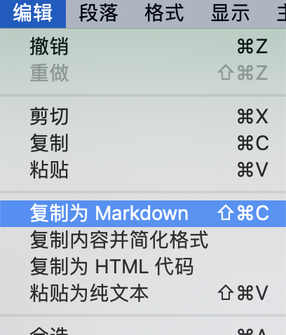

# Markdown 
## 2.1 格式问题
### 2.1.1 如何换行
#### 方法一  两段文字间两个空格再回车
1.第一种方式换行  
2.这是一个Markdown编辑器
#### 方法二  两段文字间空一行
1.第二种方式换行

2.这是一个Markdown编辑器
#### 方法三 两段文字间添加标签 `<br>..</br>`  
1.第三种方式换行</br>2.这是一个Markdown编辑器
### 2.1.2 代码块的对齐方式
#### 方法详解

1. 采用两个`TAB`键来导入代码时,以居中为例；  
&nbsp;&nbsp;&nbsp;&nbsp;&nbsp;&nbsp;&nbsp;&nbsp;直接在代码块前和后加入`<center>`和`</center>`,并且要与代码块空一行,默认为左对齐，右对齐还没发现怎么实现：
<center>

		<center>
		
		printf("Hello, world");  
		printf("Hello, Markdown");
		printf("Hello, Macdown");
		
		</center>		
</center>
2. 采用两个```来导入代码块时；  
&nbsp;&nbsp;&nbsp;&nbsp;&nbsp;&nbsp;&nbsp;&nbsp;直接在代码前加入若干TAB键来调整代码位置，左中右都可以实现：

```python
				printf("Hello, world");  
				printf("Hello, Markdown");
				printf("Hello, Macdown");
```

#### 参考  
&nbsp;&nbsp;&nbsp;&nbsp;&nbsp;&nbsp;&nbsp;&nbsp;无参考，自己研究体会出来的。

### 2.1.3 多行公式

--------------------
#### 长公式  
&nbsp;&nbsp;&nbsp;&nbsp;&nbsp;&nbsp;&nbsp;&nbsp;无需对齐使用``multline``，需对齐使用``split``，换行使用``\\``，对齐使用``&``，示例如下：  

````    
$$
\begin{multline}
x = a +b + c + \\
d + e + f + g
\end{multline}
$$  
````
$$\begin{multline}
x = a +b + c + \\  
d + e + f + g
\end{multline}$$

````markdown
$$
\begin{split}
x =& a + b + c +\\
	&d + e + f + g
\end{split}
$$
````
$$\begin{split}
x =& a + b + c +\\
	&d + e + f + g
\end{split}$$
&nbsp;&nbsp;&nbsp;&nbsp;&nbsp;&nbsp;&nbsp;&nbsp;CSDN_Markdown在对齐公式时的用法稍有不同，应该使用``eqnarray``，换行使用``\\``，对齐使用``&``，示例如下：  

````
$$
\begin{eqnarray}
x =& a + b + c + \\
   & d + e + f + g
\end{eqnarray}
$$
````  
$$
\begin{eqnarray}
x =& a + b + c + \\
   & d + e + f + g
\end{eqnarray}
$$
&nbsp;&nbsp;&nbsp;&nbsp;&nbsp;&nbsp;&nbsp;&nbsp;CSDN_Markdown好像又变了，``eqnarray``不能用，应该使用``aligned``，不管是多行公式还是公式组都可以使用这个，示例如下：  

````markdown
$$
\begin{aligned}
x =& a + b + c + \\
   & d + e + f + g
\end{aligned}
$$
````  
$$
\begin{aligned}
x =& a + b + c + \\
   & d + e + f + g
\end{aligned}
$$ 

---------------
#### 公式组  
需要对齐的公式组使用``align``，不需要对齐的公式组使用``gather``，示例如下：  
  
````
$$
\begin{gather}  
x = 5 + 2 + 1 \\  
y = x + 4
\end{gather}
$$
````
$$
\begin{gather}  
x = 5 + 2 + 1 \\  
y = x + 4
\end{gather}
$$  

````
$$
\begin{align}  
x &= 5 + 2 + 1 \\  
y &= x + 4
\end{align}
$$  
````
$$
\begin{align}  
x &= 5 + 2 + 1 \\  
y &= x + 4
\end{align}
$$ 
 
------------- 
#### 分支公式  
分段函数通常使用cases次环境表示，示例如下：
  
````
$$
y = \begin{cases}
x,\quad x\leq 0\\
-x, \quad x > 0
\end{cases}
$$
````
$$
y = \begin{cases}
x,\quad x\leq 0\\
-x, \quad x > 0
\end{cases}
$$

------------


### 2.1.4 如何添加副标题
1. 采用`副标题文字 （换一行） ---`减号两个及以上；如下所示：
 
	#标题
	副标题文字 
	---
	  

2. 采用`=`和`-`分别表示主标题和副标题，且`=`个数大于两个，`-`个数大于三个；如下所示：  
	主标题
	===
	副标题
	----
	

### 2.1.4 如何添加注释  
#### 2.1.4.1 方法详解  

#### 2.1.4.2 参考  
[在Markdown中写注释](https://www.imooc.com/article/23400)

### 2.1.5 如何插入目录
+ csdn

+ github
参考：[如何实现Github markdown 目录/页内跳转？](https://www.zhihu.com/question/58630229)  
&nbsp;&nbsp;&nbsp;&nbsp;&nbsp;&nbsp;&nbsp;&nbsp;&nbsp;&nbsp;&nbsp;[github-markdown-toc](https://github.com/ekalinin/github-markdown-toc#installation)

### 2.1.6 绘制表格
&nbsp;&nbsp;&nbsp;&nbsp;&nbsp;&nbsp;&nbsp;在markdown中绘制表格有三种方法如下：
  
+ md原生

````
|		  |值类型 			|引用类型		 |   
|-------- |:---------:    |:-----:        |    
|定义		 |直接存储数据	 |持有数据的引用   |  
|存储		 |栈				|堆		       |
````
&nbsp;&nbsp;&nbsp;&nbsp;&nbsp;&nbsp;&nbsp;结果如下：

|		  |值类型 			|引用类型		 |   
|-------- |:---------:    |:-----:        |    
|定义		 |直接存储数据	 |持有数据的引用   |  
|存储		 |栈				|堆		       |

+ html  

&nbsp;&nbsp;&nbsp;&nbsp;&nbsp;&nbsp;&nbsp;html表格的优势在于可以实现表格内换行，其它没变，就是加了个``<br>``。

````
|		  |值类型.         			   |引用类型|   
|-------- |:---------:    		  		 |:-----:|    
|定义		 |直接存储数据	 		 		|持有数据的引用|  
|存储		 |栈							   |堆|
|例子		 |1. 数字数据类型<br>2.Boolean,Char,Date| 
````
&nbsp;&nbsp;&nbsp;&nbsp;&nbsp;&nbsp;&nbsp;结果如下：

|		  |值类型.         			   |引用类型|   
|-------- |:---------:    		  		 |:-----:|    
|定义		 |直接存储数据	 		 		|持有数据的引用|  
|存储		 |栈							   |堆|
|例子		 |1. 数字数据类型<br>2.Boolean,Char,Date| 

+ Excel表格导入
  
&nbsp;&nbsp;&nbsp;&nbsp;&nbsp;&nbsp;&nbsp;可以使用软件Typora实现这一功能。Typora[下载链接](https://www.typora.io/),软件无毒，体积小且免费。  
&nbsp;&nbsp;&nbsp;&nbsp;&nbsp;&nbsp;&nbsp;操作步骤（Mac)：
  
1. 复制Excel表格里的内容；  
  
2. 粘贴至Typora中，会显示表格，将其选中；  

3. 选择``复制为Markdown``；  

4. 在Markdown中粘贴代码；

````
|      | 值类型                                    | 引用类型       |
| ---- | ----------------------------------------- | -------------- |
| 定义 | 直接存储数据                              | 持有数据的引用 |
| 存储 | 栈                                        | 堆             |
| 例子 | 1.   数字数据类型;<br>2.Boolean,Char,Date |                |

````

&nbsp;&nbsp;&nbsp;&nbsp;&nbsp;&nbsp;&nbsp;结果如下：

|      | 值类型                                    | 引用类型       |
| ---- | ----------------------------------------- | -------------- |
| 定义 | 直接存储数据                              | 持有数据的引用 |
| 存储 | 栈                                        | 堆             |
| 例子 | 1.   数字数据类型;<br>2.Boolean,Char,Date |                |
注意：要实现表格内换行也是在Excel表格中输入时，添加标签``<b>``。
Windows下的操作步骤可参考这篇博文[快速将Excel表格转换为MarkDown表格 /Convert Excel to the MarkDown](https://steemit.com/cn/@jubi/excel-markdown-convert-excel-to-the-markdown)。  
&nbsp;&nbsp;&nbsp;&nbsp;&nbsp;&nbsp;&nbsp;根据网上资料，还可以安装[exceltk](http://www.cnblogs.com/math/p/exceltk.html)，然后通过输入终端命令实现转换，个人实践发现exceltk在Mac里无法安装，所以就不演示了。

**参考：**  
[Markdown学习之(2)－绘制表格和流程图](https://blog.csdn.net/yanxiangyfg/article/details/74990232)  
[markdown表格内如何进行换行？](https://blog.csdn.net/microcosmv/article/details/51868178)  
[快速将Excel表格转换为MarkDown表格 /Convert Excel to the MarkDown](https://steemit.com/cn/@jubi/excel-markdown-convert-excel-to-the-markdown)  
[工具(3): 转换Excel表格到MarkDown：exceltk](http://www.cnblogs.com/math/p/exceltk.html)

### 2.1.9 绘制树状目录
&nbsp;&nbsp;&nbsp;&nbsp;&nbsp;&nbsp;&nbsp;我想将下图中的目录再划分为四大类（算法，数据，编程，数学），形成一个树状目录，也就是先划分出四个分支，然后每个分支再被划分若干分支。
  
&nbsp;&nbsp;&nbsp;&nbsp;&nbsp;&nbsp;&nbsp;查了很多资料都是生成文件树目录的，感觉无法套用，所以全部手工输入做了一个满足自己要求的树状目录。将如何输入其中一些符号的办法记录如下（我是Mac系统）：  

``shift``+``|``: | 目录左侧竖线  
``option``+``-``: –– 竖线旁边的横线（位于中间的长横线）  
``shift``+``-``: _ 位于下部的横线  
``-``: -- 位于中部的短横线  
最后我手工造出来的目录如下，输入三个 ` 构造一个代码块，然后就按下面所示的输入名称及横线，办法比较笨，但自认为还是比较简洁方便的。

#<center>Theory</center>
笔面试中的理论考察
-----------
```  
├── _算法  
|   |–– Algorithm ------------- 算法基础知识
|   |–– ROC_AUC --------------- ROC曲线与AUC详解
|–– _数据  
|   |—— Data ------------------ 数据   
├── _编程  
|   ├── Python ---------------- Python基础知识  
|   └── Input & Output -------- 输入输出函数详解  
├── _数学  
|   ├── Mathmetics ------------ 算法中涉及的数学知识  
```


**参考：**  
[Markdown语法：表示目录文件结构，方法汇总](https://vimsky.com/article/3606.html)
## 画流程图
**参考：**  
[Markdown快速入门](https://zhuanlan.zhihu.com/p/40446298)

# 2.2 符号问题
   
  
 
### 2.2.1 字母头顶加倒三角如$\widehat f$
&nbsp;&nbsp;&nbsp;&nbsp;&nbsp;&nbsp;&nbsp;在字母前加 \hat,具体如下：  
<center>\$\hat f(x)$</center>

&nbsp;&nbsp;&nbsp;&nbsp;&nbsp;&nbsp;&nbsp;结果显示为
$$\hat f(x)$$
&nbsp;&nbsp;&nbsp;&nbsp;&nbsp;&nbsp;&nbsp;当只有一个字母时，此方法的显示为$\hat f$, 此时对 \hat 进行修改可以使倒三角位于字母正上方：  
<center>\$widehat f$</center>  

&nbsp;&nbsp;&nbsp;&nbsp;&nbsp;&nbsp;&nbsp;结果显示为
$$\widehat f$$
### 2.2.2 添加微积分符号
**方法详解**  


### 2.2.3 空心字母   
``$\mathbb{R}$``$\rightarrow$ $\mathbb{R}$  
### 2.2.4 梯度  
``$\nabla$`` $\rightarrow$ $\nabla$

**参考**  
[Markdown中Latex 数学公式基本语法](https://blog.csdn.net/u014630987/article/details/70156489)  
[markdown 数学公式Latex语法](https://juejin.im/post/5af93ec6518825428b38e7f4)  
[数学、物理中常用的希腊字母怎么读？](https://www.zhihu.com/question/23655549)
  


 


 


