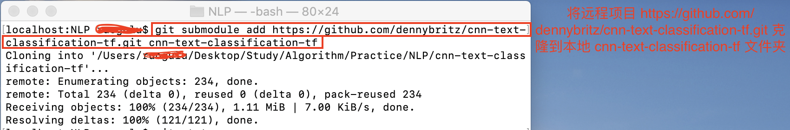
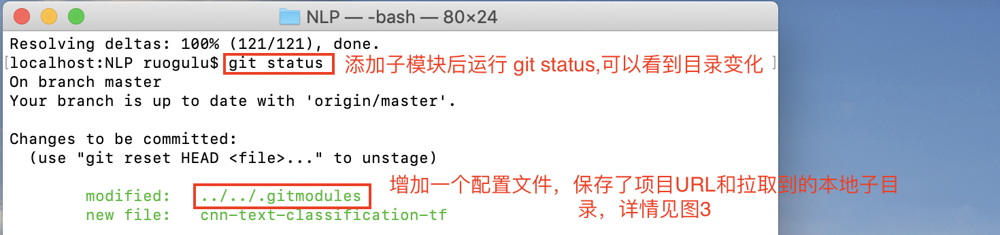

# 
第4章 子模块

以将经典文本分类项目[cnn-text-classification-tf](https://github.com/dennybritz/cnn-text-classification-tf "With a Title")克隆到我[github](https://github.com/dennybritz/cnn-text-classification-tf "With a Title")中[Algorithm](https://github.com/Roggu123/Algorithm "With a Title")仓库子目录下为例。子目录具体路径为[Algorithm/Practice/NLP/cnn-text-classification-tf](https://github.com/Roggu123/Algorithm/tree/master/Practice/NLP "With a Title")。
## 4.1 将其它仓库放在某仓库子目录下
### 4.1.1 步骤
1.外部仓库克隆到本地子目录中：

	localhost:NLP 用户名$ git submodule add https://github.com/dennybritz/cnn-text-classification-tf.git cnn-text-classification-tf
	Cloning into '/Users/用户名/Desktop/Study/Algorithm/Practice/NLP/cnn-text-classification-tf'...
	remote: Enumerating objects: 234, done.
	remote: Total 234 (delta 0), reused 0 (delta 0), pack-reused 234
	Receiving objects: 100% (234/234), 1.11 MiB | 7.00 KiB/s, done.
	Resolving deltas: 100% (121/121), done. 
	
结果如下图：  

2.加入子模块后立刻运行 git status ，查看文件变动：

	localhost:NLP 用户名$ git status
	On branch master
	Your branch is up to date with 'origin/master'.

	Changes to be committed:  
		(use "git reset HEAD <file>..." to unstage)

	modified:   ../../.gitmodules
	new file:   cnn-text-classification-tf

结果如下图：  

3.文件 .gitmodules 是一个配置文件，保存了项目 URL 和你拉取到的本地子目录：
	
	localhost:NLP 用户名$ cat ../../.gitmodules
	[submodule "Practice/NLP/NLP"]
	path = Practice/NLP/NLP
	url = https://github.com/dennybritz/cnn-text-classification-tf.git
	[submodule "Practice/NLP/cnn-text-classification-tf"]
	path = Practice/NLP/cnn-text-classification-tf
	url = https://github.com/dennybritz/cnn-text-classification-tf.git

结果如下图：  

4.执行上传至远程库的操作，细节见图4，5；

	localhost:NLP 用户名$ git commit -am 'Added cnn-text-classification-tf module'
	[master 1f68457] Added cnn-text-classification-tf module  
		35 files changed, 22 insertions(+), 2368 deletions(-)
		rewrite Book/README.md (84%)
	delete mode 100644 Practice/CV/FaceDetection/face_detection_comparision/face_detection_comparision.xcodeproj/project.pbxproj
	delete mode 100644 Practice/CV/FaceDetection/face_detection_comparision/face_detection_comparision.xcodeproj/project.xcworkspace/contents.xcworkspacedata
	.....  此处省略若干delete mode
	create mode 160000 Practice/NLP/cnn-text-classification-tf
	localhost:NLP ruogulu$ git push -u origin master
	Enter passphrase for key '/Users/ruogulu/.ssh/id_rsa': 
	Counting objects: 25, done.
	Delta compression using up to 4 threads.
	Compressing objects: 100% (23/23), done.
	Writing objects: 100% (25/25), 12.37 KiB | 1.77 MiB/s, done.
	Total 25 (delta 8), reused 0 (delta 0)
	remote: Resolving deltas: 100% (8/8), completed with 7 local objects.
	To github.com:Roggu123/Algorithm.git
	13558c6..1f68457  master -> master
	Branch 'master' set up to track remote branch 'master' from 'origin'.

结果如下图：  

### 4.1.2 推送本地改动注意细节  
见上图
## 4.2 如何向子模块中添加文件
把终端中的错误截图记录下来；  
尝试网页Upload;
### 4.2.3 参考
ZoenLeo：[”如何在大型项目中使用Git子模块开发“] (https://juejin.im/post/5c1c5d305188256a272aa0ec "With a Title")， https://juejin.im/post/5c1c5d305188256a272aa0ec （2019/2/11）  
ZoenLeo：[”如何在大型项目中使用Git子模块开发“] (https://juejin.im/post/5c1c5d305188256a272aa0ec "With a Title")， https://juejin.im/post/5c1c5d305188256a272aa0ec （2019/2/11）

