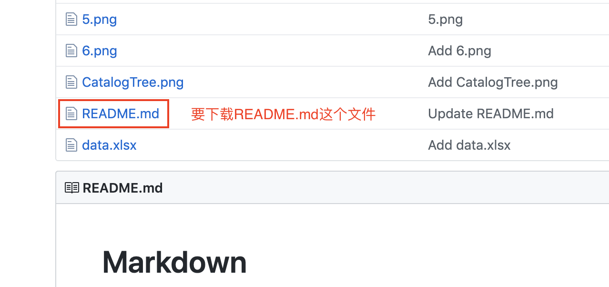
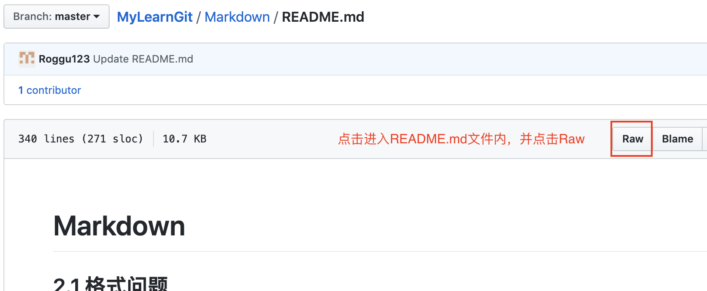
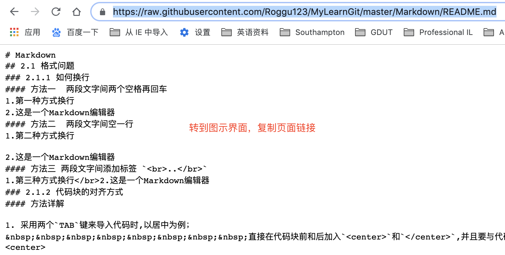
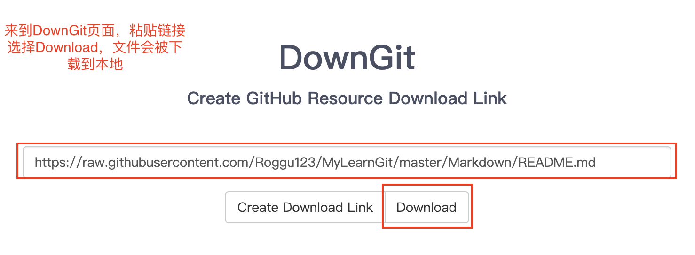

#  下载github单个文件  
有时我们并不需要下载整个github仓库，而只需下载其中某一个文件，在github中打开该文件，选择`raw`,将打开页面的链接拷贝，粘贴至网站[DownGit](https://minhaskamal.github.io/DownGit/#/home),选择下载就可以了，具体见下图：  

1. 第一步  
  
2. 第二步
  
3. 第三步
  
4. 第四步

