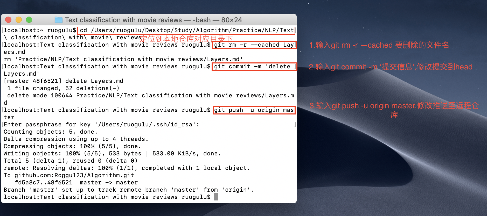

# 删除github远程仓库中的文件
    git rm -r --cached .idea  #--cached不会把本地的.idea删除
    git commit -m 'delete .idea dir'
    git push -u origin master
    
 具体情况见下图：  
 
 
 + **参考**  
 
 [如何在 GitHub.com 上删除某个 Repository 中的某个文件夹？](https://www.zhihu.com/question/20418177)

